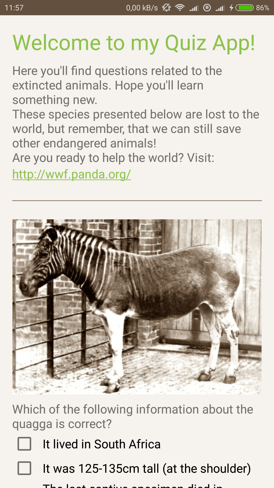
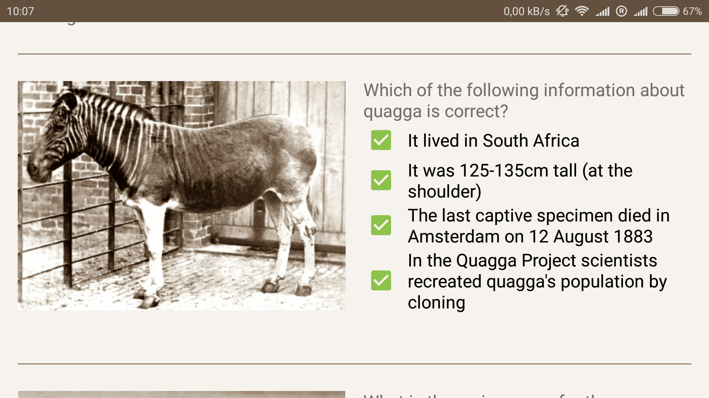

This is my Project 3 from Google Developer Challenge Scholarship: Android Basics
It is a quiz app about extincted aminals

 

In the app I used:
Photo of the rhino
By John and Karen Hollingsworth, US Fish and Wildlife Service [Public domain], via Wikimedia Commons

Photo of the tarpan
By Scherer [Public domain], via Wikimedia Commons

Photo of the quagga
By Frederick York (d. 1903) [Public domain], via Wikimedia Commons

Photo of the tiger
Autor: F. W. Bond (d. 1942) [Public domain], Wikimedia Commons

Photo of the tortoise
By Arturo de Frias Marques (Own work) [CC BY-SA 3.0 (https://creativecommons.org/licenses/by-sa/3.0)], via Wikimedia Commons

Photo of the seal
By New York Zoological Society. [Public domain], via Wikimedia Commons
